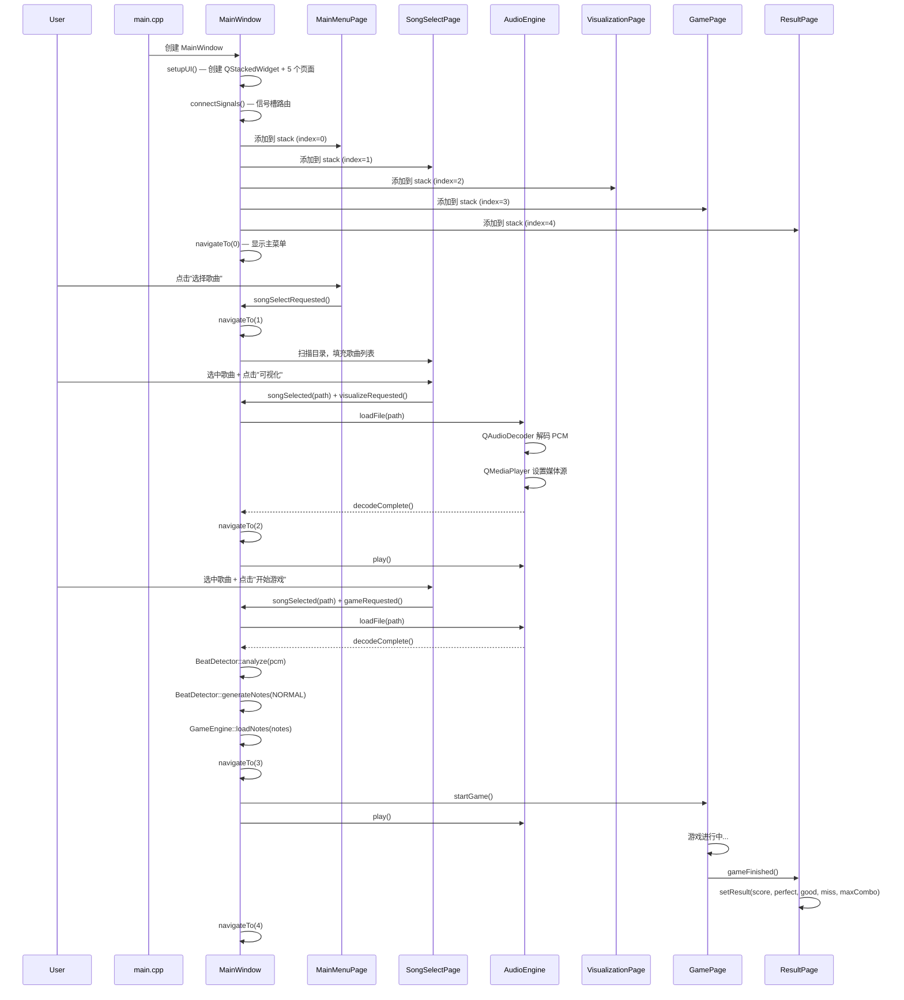
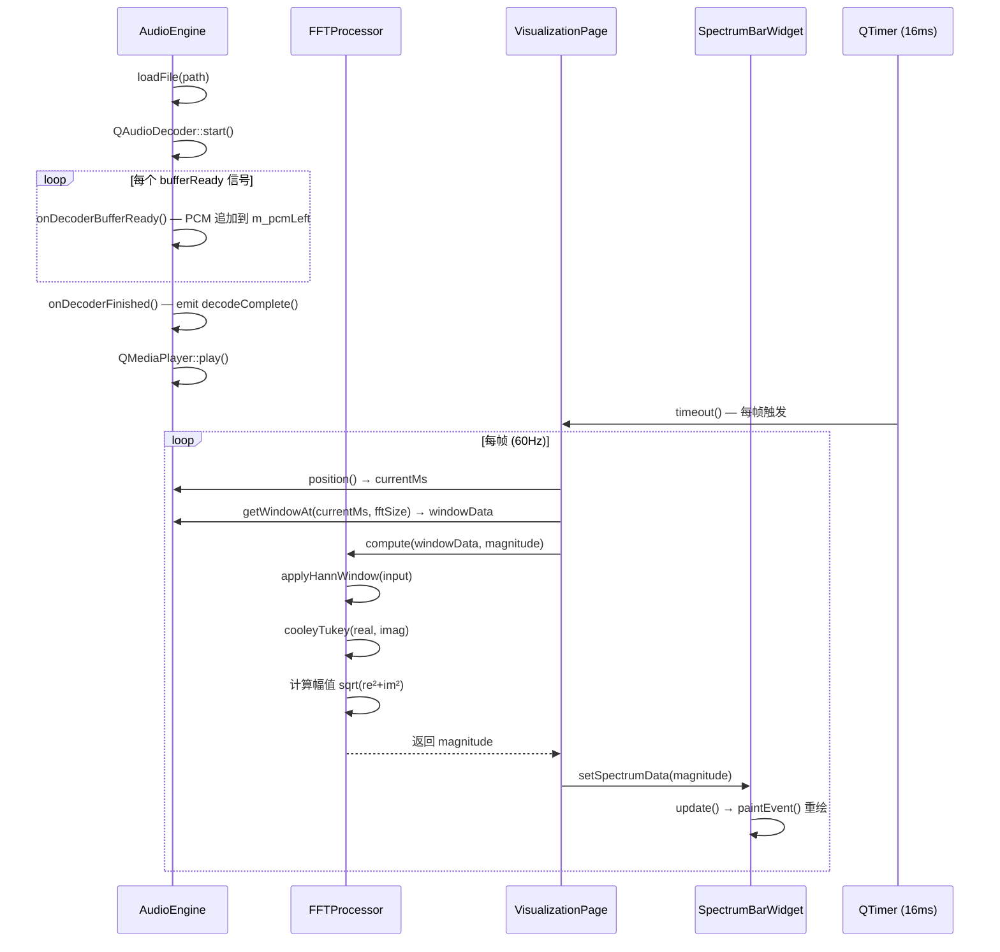
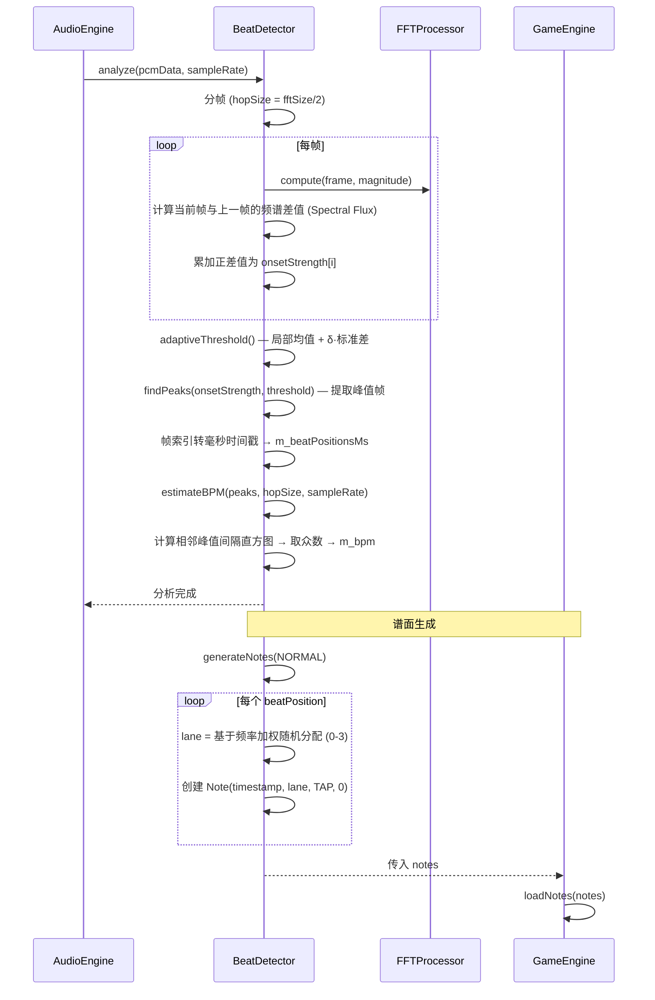
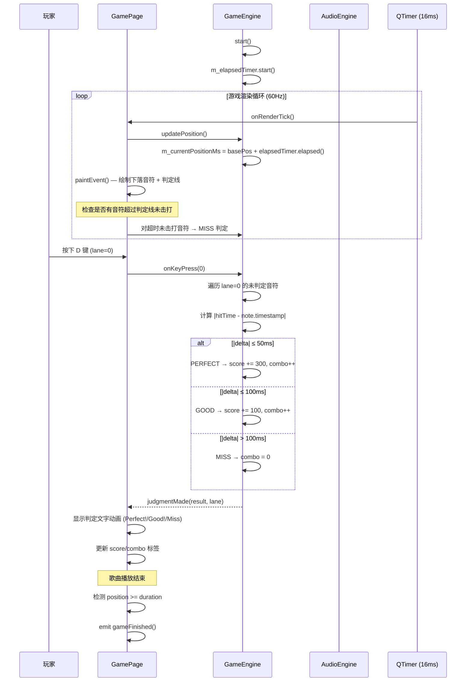
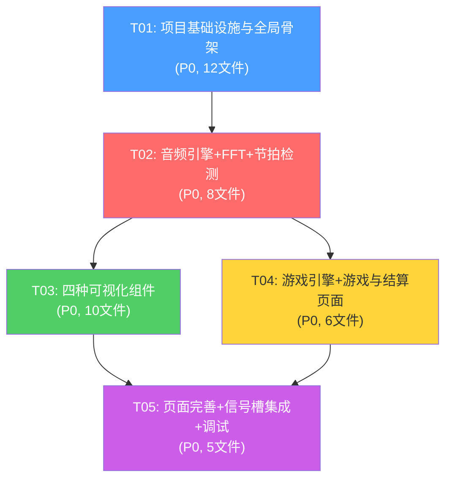

# 音频处理与节奏游戏系统 — 系统架构设计

> 架构师：高见远（Gao） | 基于 PRD v1.0

---

## 1. 实现方案与框架选型

### 1.1 核心技术挑战

| 挑战 | 分析 | 解决方案 |
|------|------|----------|
| 手写 FFT 实时性 | 2048 点 FFT 约 22528 次复数乘加，需在 16ms/帧内完成 | Cooley-Tukey 原地算法 + 预计算旋转因子表 + MSVC Release 优化；若超标则降窗口至 1024 |
| 音频与画面精确同步 | QMediaPlayer::position 信号精度约 100-200ms，不够精确 | position 信号作为基准锚点，帧间用 QElapsedTimer 插值，误差 <20ms |
| PCM 数据获取 | QMediaPlayer 不直接暴露 PCM | 使用 QAudioDecoder 离线解码完整音频为 PCM 缓冲，QMediaPlayer 仅负责播放 |
| 节拍检测鲁棒性 | 简单能量阈值对动态范围大的音乐效果差 | Spectral Flux 算法 + 自适应阈值（移动均值 + 标准差偏移） |
| 游戏判定精度 | 需亚 50ms 判定窗口 | QMediaPlayer::position 驱动 + QElapsedTimer 精确插值 |

### 1.2 框架选型

| 组件 | 选型 | 理由 |
|------|------|------|
| UI 框架 | Qt 6.10.3 Widgets | 项目约束，成熟稳定 |
| 音频播放 | QMediaPlayer + QAudioOutput | Qt Multimedia 原生，支持 MP3/WAV/FLAC，自带暂停/跳转/倍速 |
| 音频解码 | QAudioDecoder | 离线提取 PCM 数据供 FFT 和节拍检测使用 |
| FFT | 手写 Cooley-Tukey | 需求约束，不调第三方库 |
| 可视化渲染 | QWidget + QPainter | 自定义绘制，4 种可视化均为 paintEvent 实现 |
| 页面导航 | QStackedWidget | 轻量级页面切换，适合 5 屏应用 |
| 样式 | QSS (Qt Style Sheets) | 类 CSS 语法，全局主题统一 |

### 1.3 架构模式

采用 **分层 MVC** 架构：

```
┌─────────────────────────────────────────────┐
│  View Layer (Pages + Visualization Widgets)  │
│  MainMenuPage / SongSelectPage /             │
│  VisualizationPage / GamePage / ResultPage  │
├─────────────────────────────────────────────┤
│  Controller Layer (MainWindow)               │
│  页面导航 + 信号槽路由 + 全局状态协调         │
├─────────────────────────────────────────────┤
│  Model/Service Layer                         │
│  AudioEngine / FFTProcessor /                │
│  BeatDetector / GameEngine                   │
└─────────────────────────────────────────────┘
```

**数据流向**：`AudioEngine(PCM) → FFTProcessor(频谱) → VisualizationWidgets(渲染)`  
**游戏流向**：`AudioEngine(PCM) → BeatDetector(节拍) → GameEngine(谱面+判定) → GamePage(渲染)`

---

## 2. 文件列表

```
C:\Users\v\Desktop\qt\game\
├── main.cpp                              # 应用入口
├── MainWindow.h                          # 主窗口（替代原 game.h）
├── MainWindow.cpp                        # 主窗口实现（替代原 game.cpp）
├── game.qrc                             # Qt 资源文件（更新：添加 QSS）
├── game.vcxproj                         # VS 项目文件（更新：添加 multimedia + 新文件）
├── docs/
│   └── ARCHITECTURE.md                   # 本文档
├── include/
│   ├── AudioEngine.h                     # 音频引擎
│   ├── FFTProcessor.h                   # FFT 处理器
│   ├── BeatDetector.h                   # 节拍检测器
│   ├── GameEngine.h                     # 游戏逻辑引擎
│   ├── Note.h                           # 音符数据模型
│   ├── SpectrumBarWidget.h              # 频谱柱状图
│   ├── CircularSpectrumWidget.h        # 圆形频谱环
│   ├── WaveformWidget.h                # 波形示波器
│   ├── WaterfallWidget.h               # 瀑布图
│   ├── MainMenuPage.h                  # 主菜单页
│   ├── SongSelectPage.h               # 歌曲选择页
│   ├── VisualizationPage.h            # 可视化模式页
│   ├── GamePage.h                      # 游戏界面页
│   └── ResultPage.h                    # 结算页
├── src/
│   ├── AudioEngine.cpp
│   ├── FFTProcessor.cpp
│   ├── BeatDetector.cpp
│   ├── GameEngine.cpp
│   ├── Note.cpp
│   ├── SpectrumBarWidget.cpp
│   ├── CircularSpectrumWidget.cpp
│   ├── WaveformWidget.cpp
│   ├── WaterfallWidget.cpp
│   ├── MainMenuPage.cpp
│   ├── SongSelectPage.cpp
│   ├── VisualizationPage.cpp
│   ├── GamePage.cpp
│   └── ResultPage.cpp
└── resources/
    └── style.qss                         # 全局 QSS 主题
```

**文件总计**：14 个头文件 + 14 个实现文件 + 4 个项目/资源文件 = **32 个文件**

---

## 3. 数据结构与接口

### 3.1 类图

```mermaid
classDiagram
    direction TB

    class MainWindow {
        -QStackedWidget* m_stack
        -AudioEngine* m_audioEngine
        -FFTProcessor* m_fftProcessor
        -BeatDetector* m_beatDetector
        -GameEngine* m_gameEngine
        -MainMenuPage* m_mainMenuPage
        -SongSelectPage* m_songSelectPage
        -VisualizationPage* m_visPage
        -GamePage* m_gamePage
        -ResultPage* m_resultPage
        -QString m_currentSongPath
        +MainWindow(QWidget* parent)
        -void setupUI()
        -void connectSignals()
        -void navigateTo(int pageIndex)
        -void onSongSelected(QString path)
        -void onStartVisualization()
        -void onStartGame()
        -void onGameFinished()
    }

    class AudioEngine {
        -QMediaPlayer* m_player
        -QAudioOutput* m_audioOutput
        -QAudioDecoder* m_decoder
        -QVector~float~ m_pcmLeft
        -QVector~float~ m_pcmRight
        -int m_sampleRate
        -int m_channels
        -qint64 m_durationMs
        -bool m_decodeComplete
        +AudioEngine(QObject* parent)
        +~AudioEngine()
        +void loadFile(QString path)
        +void play()
        +void pause()
        +void seek(qint64 ms)
        +void setVolume(float vol)
        +void setPlaybackRate(qreal rate)
        +QMediaPlayer::PlaybackState state() const
        +qint64 position() const
        +qint64 duration() const
        +int sampleRate() const
        +const QVector~float~& pcmData() const
        +QVector~float~ getWindowAt(qint64 ms, int windowSize) const
        +bool isDecodeComplete() const
        +signals: void positionChanged(qint64 ms)
        +signals: void durationChanged(qint64 ms)
        +signals: void decodeComplete()
        +signals: void playbackStateChanged(QMediaPlayer::PlaybackState)
        -void onDecoderBufferReady()
        -void onDecoderFinished()
    }

    class FFTProcessor {
        -int m_windowSize
        -QVector~float~ m_hannWindow
        -QVector~float~ m_twiddleCos
        -QVector~float~ m_twiddleSin
        +FFTProcessor(int windowSize)
        +void setWindowSize(int size)
        +int windowSize() const
        +void compute(QVector~float~ input, QVector~float~& magnitude)
        -void cooleyTukey(QVector~float~& real, QVector~float~& imag)
        -void buildTwiddleFactors()
        -void buildHannWindow()
    }

    class BeatDetector {
        -float m_bpm
        -QVector~qint64~ m_beatPositionsMs
        -int m_fftSize
        -int m_hopSize
        +BeatDetector(QObject* parent)
        +void analyze(const QVector~float~& pcm, int sampleRate)
        +float bpm() const
        +const QVector~qint64~& beatPositions() const
        +QVector~Note~ generateNotes(Difficulty difficulty) const
        -QVector~float~ computeSpectralFlux(const QVector~float~& pcm, int sampleRate)
        -QVector~int~ findPeaks(const QVector~float~& flux, float threshold)
        -float estimateBPM(const QVector~int~& peakFrames, int hopSize, int sampleRate)
        -float adaptiveThreshold(const QVector~float~& flux, int index, int windowSize)
    }

    class Note {
        <<struct>>
        +qint64 timestamp
        +int lane
        +NoteType type
        +qint64 holdDuration
        +Note() = default
        +Note(qint64 ts, int ln, NoteType tp, qint64 holdDur)
    }

    class NoteType {
        <<enum>>
        TAP = 0
        HOLD = 1
    }

    class Difficulty {
        <<enum>>
        EASY = 0
        NORMAL = 1
        HARD = 2
    }

    class GameEngine {
        -QVector~Note~ m_notes
        -QSet~int~ m_judgedIndices
        -int m_score
        -int m_combo
        -int m_maxCombo
        -int m_perfectCount
        -int m_goodCount
        -int m_missCount
        -qint64 m_currentPositionMs
        -float m_scrollSpeed
        -QElapsedTimer m_elapsedTimer
        +GameEngine(QObject* parent)
        +void loadNotes(QVector~Note~ notes, float bpm)
        +void start()
        +void pause()
        +void resume()
        +JudgeResult onKeyPress(int lane)
        +void updatePosition()
        +qint64 currentPosition() const
        +int score() const
        +int combo() const
        +int maxCombo() const
        +int perfectCount() const
        +int goodCount() const
        +int missCount() const
        +QVector~Note~ visibleNotes() const
        +void reset()
        +signals: void scoreChanged(int score)
        +signals: void comboChanged(int combo)
        +signals: void judgmentMade(JudgeResult result, int lane)
        +signals: void noteMissed(int lane)
    }

    class JudgeResult {
        <<enum>>
        PERFECT = 0
        GOOD = 1
        MISS = 2
    }

    class SpectrumBarWidget {
        -QVector~float~ m_magnitude
        -int m_barCount
        -QColor m_barColor
        +SpectrumBarWidget(QWidget* parent)
        +void setSpectrumData(QVector~float~ magnitude)
        -void paintEvent(QPaintEvent* event) override
    }

    class CircularSpectrumWidget {
        -QVector~float~ m_magnitude
        -int m_segments
        +CircularSpectrumWidget(QWidget* parent)
        +void setSpectrumData(QVector~float~ magnitude)
        -void paintEvent(QPaintEvent* event) override
    }

    class WaveformWidget {
        -QVector~float~ m_samples
        +WaveformWidget(QWidget* parent)
        +void setWaveformData(QVector~float~ samples)
        -void paintEvent(QPaintEvent* event) override
    }

    class WaterfallWidget {
        -QList~QVector~float~~ m_history
        -int m_maxHistory
        +WaterfallWidget(QWidget* parent)
        +void setSpectrumData(QVector~float~ magnitude)
        -void paintEvent(QPaintEvent* event) override
    }

    class MainMenuPage {
        -QPushButton* m_selectSongBtn
        -QPushButton* m_settingsBtn
        -QPushButton* m_exitBtn
        +MainMenuPage(QWidget* parent)
        +signals: void songSelectRequested()
        +signals: void exitRequested()
    }

    class SongSelectPage {
        -QListWidget* m_songList
        -QPushButton* m_visualizeBtn
        -QPushButton* m_gameBtn
        -QPushButton* m_backBtn
        -QLabel* m_bpmLabel
        -QString m_selectedPath
        +SongSelectPage(QWidget* parent)
        +void setSongs(QStringList paths)
        +QString selectedSong() const
        +void setBpmDisplay(float bpm)
        +signals: void songSelected(QString path)
        +signals: void visualizeRequested()
        +signals: void gameRequested()
        +signals: void backRequested()
    }

    class VisualizationPage {
        -QStackedWidget* m_visStack
        -SpectrumBarWidget* m_barWidget
        -CircularSpectrumWidget* m_circularWidget
        -WaveformWidget* m_waveformWidget
        -WaterfallWidget* m_waterfallWidget
        -QPushButton* m_playPauseBtn
        -QSlider* m_positionSlider
        -QSlider* m_volumeSlider
        -QComboBox* m_fftSizeCombo
        -QComboBox* m_visModeCombo
        -QLabel* m_timeLabel
        +VisualizationPage(QWidget* parent)
        +void setSpectrumData(QVector~float~ magnitude)
        +void setWaveformData(QVector~float~ samples)
        +void setPlaybackState(QMediaPlayer::PlaybackState state)
        +void setPosition(qint64 ms)
        +void setDuration(qint64 ms)
        +signals: void playPauseClicked()
        +signals: void seekRequested(qint64 ms)
        +signals: void volumeChanged(float vol)
        +signals: void fftSizeChanged(int size)
        +signals: void visModeChanged(int index)
        +signals: void backRequested()
    }

    class GamePage {
        -GameEngine* m_engine
        -QTimer* m_renderTimer
        -QLabel* m_scoreLabel
        -QLabel* m_comboLabel
        -QLabel* m_judgeLabel
        -QMap~int, bool~ m_keyPressed
        -float m_judgeLineY
        -float m_noteSpeed
        +GamePage(GameEngine* engine, QWidget* parent)
        +void startGame()
        +void pauseGame()
        -void paintEvent(QPaintEvent* event) override
        -void keyPressEvent(QKeyEvent* event) override
        -void keyReleaseEvent(QKeyEvent* event) override
        -void onRenderTick()
        -void onJudgeResult(JudgeResult result, int lane)
        +signals: void gameFinished()
        +signals: void pauseRequested()
    }

    class ResultPage {
        -QLabel* m_scoreLabel
        -QLabel* m_gradeLabel
        -QLabel* m_perfectLabel
        -QLabel* m_goodLabel
        -QLabel* m_missLabel
        -QLabel* m_maxComboLabel
        -QPushButton* m_retryBtn
        -QPushButton* m_backBtn
        +ResultPage(QWidget* parent)
        +void setResult(int score, int perfect, int good, int miss, int maxCombo)
        +signals: void retryRequested()
        +signals: void backRequested()
    }

    MainWindow --> AudioEngine : 持有
    MainWindow --> FFTProcessor : 持有
    MainWindow --> BeatDetector : 持有
    MainWindow --> GameEngine : 持有
    MainWindow --> MainMenuPage : 持有
    MainWindow --> SongSelectPage : 持有
    MainWindow --> VisualizationPage : 持有
    MainWindow --> GamePage : 持有
    MainWindow --> ResultPage : 持有
    VisualizationPage --> SpectrumBarWidget : 持有
    VisualizationPage --> CircularSpectrumWidget : 持有
    VisualizationPage --> WaveformWidget : 持有
    VisualizationPage --> WaterfallWidget : 持有
    GamePage --> GameEngine : 引用
    GameEngine --> Note : 使用
    BeatDetector --> Note : 生成
    Note --> NoteType : 包含
    AudioEngine --> QMediaPlayer : 持有
    AudioEngine --> QAudioDecoder : 持有
```



### 3.2 核心数据结构详述

#### Note 结构体
```cpp
struct Note {
    qint64 timestamp;      // 音符出现时间（毫秒）
    int lane;              // 轨道编号：0=D, 1=F, 2=J, 3=K
    NoteType type;         // TAP 或 HOLD
    qint64 holdDuration;   // 长按持续时间（毫秒），TAP 音符为 0

    enum NoteType { TAP = 0, HOLD = 1 };
    Note(qint64 ts = 0, int ln = 0, NoteType tp = TAP, qint64 holdDur = 0);
};
```

#### 判定常量
```cpp
namespace JudgeConfig {
    constexpr qint64 PERFECT_WINDOW = 50;   // ±50ms
    constexpr qint64 GOOD_WINDOW = 100;      // ±100ms
    // 超过 ±100ms 为 MISS
    constexpr int PERFECT_SCORE = 300;
    constexpr int GOOD_SCORE = 100;
    constexpr float SCROLL_SPEED = 0.6f;    // 像素/毫秒（下落速度）
    constexpr qint64 VISIBLE_AHEAD = 2000;  // 提前 2 秒显示音符
}
```

#### FFT 配置
```cpp
namespace FFTConfig {
    constexpr int DEFAULT_WINDOW = 1024;
    constexpr int SUPPORTED_WINDOWS[] = {512, 1024, 2048};
    constexpr int REFRESH_RATE_HZ = 60;
    constexpr int TIMER_INTERVAL_MS = 16;    // ≈60Hz
}
```

---

## 4. 程序调用流程

### 4.1 应用启动与页面导航



### 4.2 音频解码与 FFT 可视化循环



### 4.3 节拍检测流程



### 4.4 游戏判定流程



---

## 5. 待明确事项

| 编号 | 问题 | 当前假设 | 建议 |
|------|------|----------|------|
| U-01 | QMediaPlayer::position 信号精度 | 约 100-200ms，用 QElapsedTimer 插值 | 需实测验证，若仍不足可考虑低层音频 API |
| U-02 | QAudioDecoder 对 FLAC 的支持 | Qt Multimedia 通过系统插件支持 FLAC | Windows 上可能需安装编解码器；若不支持则降级为 WAV/MP3 |
| U-03 | 谱面密度控制策略 | 使用 Difficulty 枚举（EASY/NORMAL/HARD） | EASY: 每 2 拍一个音符；NORMAL: 每拍一个；HARD: 每拍 1-2 个 |
| U-04 | 歌曲选择默认扫描目录 | 使用 QStandardPaths::MusicLocation | 可在设置中自定义 |
| U-05 | 长按音符 (Hold) 的判定逻辑 | P1 选做，架构已预留 NoteType::HOLD 字段 | 首版仅实现 TAP，Hold 作为扩展 |
| U-06 | 排行榜持久化方案 | 使用 QSettings 保存至本地 | P2 优先级，首版不实现 |
| U-07 | game.ui 文件处置 | 删除，所有 UI 程序化创建 | 需从 vcxproj 移除 QtUic 引用 |
| U-08 | vcxproj 中 Qt 模块声明 | 需添加 multimedia 和 multimediawidgets | 修改 QtModules 属性为 `core;gui;widgets;multimedia;multimediawidgets` |

---

## 6. 依赖包列表

| 包/模块 | 版本 | 用途 |
|---------|------|------|
| Qt Core | 6.10.3 | 基础类型、信号槽、QObject、QTimer、QElapsedTimer |
| Qt Gui | 6.10.3 | QPainter、QColor、QFont、QImage |
| Qt Widgets | 6.10.3 | QMainWindow、QWidget、QStackedWidget、QPushButton 等控件 |
| Qt Multimedia | 6.10.3 | QMediaPlayer、QAudioOutput、QAudioDecoder、QAudioBuffer |
| Qt MultimediaWidgets | 6.10.3 | (预留，视频或高级音频控件可能使用) |

**无第三方库依赖** — FFT、节拍检测、可视化全部手写实现。

---

## 7. 任务列表

### T01: 项目基础设施与全局骨架

**优先级**: P0 | **依赖**: 无

**描述**: 搭建项目基础框架。修改现有空壳文件为 MainWindow 架构，更新 vcxproj 添加 multimedia 模块和所有新文件声明，创建目录结构，编写全局 QSS 主题，实现 MainWindow 的 QStackedWidget 页面导航框架。

**涉及文件**:
- `main.cpp` (修改：替换 game 为 MainWindow)
- `MainWindow.h` (新建：替代 game.h)
- `MainWindow.cpp` (新建：替代 game.cpp)
- `game.qrc` (修改：添加 style.qss 资源)
- `game.vcxproj` (修改：添加 multimedia 模块 + 新文件条目)
- `resources/style.qss` (新建：全局暗色主题)
- `include/MainMenuPage.h` + `src/MainMenuPage.cpp` (新建：主菜单页面骨架)
- `include/SongSelectPage.h` + `src/SongSelectPage.cpp` (新建：歌曲选择页面骨架)
- `include/VisualizationPage.h` + `src/VisualizationPage.cpp` (新建：可视化页面骨架)
- `include/GamePage.h` + `src/GamePage.cpp` (新建：游戏页面骨架)
- `include/ResultPage.h` + `src/ResultPage.cpp` (新建：结算页面骨架)

**验收标准**: 编译通过，5 个页面可导航切换（内容为空占位），QSS 暗色主题生效。

---

### T02: 音频引擎 + FFT + 节拍检测（核心算法层）

**优先级**: P0 | **依赖**: T01（项目结构就绪）

**描述**: 实现 AudioEngine（QMediaPlayer 播放 + QAudioDecoder 解码 PCM 缓冲）、FFTProcessor（手写 Cooley-Tukey + Hann 窗 + 旋转因子预计算）、BeatDetector（Spectral Flux 节拍检测 + BPM 估计 + 谱面生成）。这是整个系统的数据和算法基础。

**涉及文件**:
- `include/AudioEngine.h` + `src/AudioEngine.cpp` (音频播放/解码/PCM缓冲)
- `include/FFTProcessor.h` + `src/FFTProcessor.cpp` (手写 FFT)
- `include/BeatDetector.h` + `src/BeatDetector.cpp` (节拍检测)
- `include/Note.h` + `src/Note.cpp` (音符数据模型)

**验收标准**: 加载 WAV/MP3 文件后能解码 PCM、执行 FFT 输出频谱幅值、检测出 BPM 和节拍位置列表、基于节拍生成 Note 向量。

---

### T03: 四种可视化组件

**优先级**: P0 | **依赖**: T02（需要 FFTProcessor 输出格式确定）

**描述**: 实现 4 种自定义 QWidget 可视化组件：SpectrumBarWidget（经典柱状频谱图，渐变色柱）、CircularSpectrumWidget（圆形频谱环，360° 辐射）、WaveformWidget（波形示波器，时域显示）、WaterfallWidget（瀑布图/频谱图，历史频谱滚动）。在 VisualizationPage 中集成切换逻辑，连接 AudioEngine + FFTProcessor 的 60Hz 渲染循环。

**涉及文件**:
- `include/SpectrumBarWidget.h` + `src/SpectrumBarWidget.cpp`
- `include/CircularSpectrumWidget.h` + `src/CircularSpectrumWidget.cpp`
- `include/WaveformWidget.h` + `src/WaveformWidget.cpp`
- `include/WaterfallWidget.h` + `src/WaterfallWidget.cpp`
- `include/VisualizationPage.h` + `src/VisualizationPage.cpp` (更新：集成可视化组件 + FFT 渲染循环 + 播放控件)

**验收标准**: 加载音频后，4 种可视化模式可运行时切换，60Hz 流畅渲染，暂停/跳转/音量/倍速控制正常。

---

### T04: 游戏引擎 + 游戏与结算页面

**优先级**: P0 | **依赖**: T02（需要 BeatDetector 的 Note 生成和 AudioEngine 的播放同步）

**描述**: 实现 GameEngine（判定系统 PERFECT/GOOD/MISS、连击得分、位置同步）、GamePage（4 轨下落式音符渲染、判定线、按键事件 D/F/J/K、判定文字动画、连击/分数显示）、ResultPage（最终得分、各判定统计、最大连击、S/A/B/C/D 评级、重试/返回按钮）。实现精确的音频-画面同步（QMediaPlayer::position + QElapsedTimer 插值）。

**涉及文件**:
- `include/GameEngine.h` + `src/GameEngine.cpp` (游戏逻辑 + 判定)
- `include/GamePage.h` + `src/GamePage.cpp` (更新：4 轨下落渲染 + 键盘输入 + 判定动画)
- `include/ResultPage.h` + `src/ResultPage.cpp` (更新：结算数据展示)

**验收标准**: 选择歌曲后进入游戏，音符按节拍下落，按键判定正确（Perfect ±50ms / Good ±100ms / Miss >100ms），游戏结束显示结算页，评级正确。

---

### T05: 全部页面完善 + 信号槽集成 + 最终调试

**优先级**: P0 | **依赖**: T03 + T04（可视化组件和游戏逻辑均就绪）

**描述**: 完善 MainMenuPage（Logo/标题、选择歌曲/退出按钮）、SongSelectPage（歌曲列表扫描、BPM 预览、可视化/游戏入口）、MainWindow 信号槽全连通（页面间数据传递、AudioEngine 生命周期管理）、QSS 细节调优、整体集成测试。修复音频同步、FFT 性能、游戏判定等集成问题。

**涉及文件**:
- `include/MainMenuPage.h` + `src/MainMenuPage.cpp` (更新：完善 UI 和按钮交互)
- `include/SongSelectPage.h` + `src/SongSelectPage.cpp` (更新：文件扫描 + BPM 显示)
- `MainWindow.h` + `MainWindow.cpp` (更新：全信号槽连通 + 音频引擎管理)
- `resources/style.qss` (更新：细节调优)
- `main.cpp` (最终确认)

**验收标准**: 从主菜单 → 选歌 → 可视化/游戏 → 结算的完整流程畅通，所有控件功能正常，视觉效果统一。

---

## 8. 共享知识（工程师必读）

### 8.1 命名规范

| 类别 | 规范 | 示例 |
|------|------|------|
| 类名 | PascalCase | `AudioEngine`, `FFTProcessor` |
| 成员变量 | m_ 前缀 + camelCase | `m_player`, `m_pcmLeft` |
| 方法名 | camelCase | `loadFile()`, `compute()` |
| 信号 | camelCase，过去时或 Requested 后缀 | `decodeComplete()`, `seekRequested()` |
| 槽函数 | on + 信号名 | `onDecoderBufferReady()` |
| 常量/枚举 | UPPER_SNAKE_CASE / PascalCase | `PERFECT_WINDOW`, `NoteType::TAP` |
| 头文件保护 | `#pragma once` | 统一使用 |

### 8.2 信号槽约定

- **跨页面通信**：所有页面间通信通过 MainWindow 路由，页面不直接互相引用
- **Page → MainWindow**：使用信号（如 `songSelected(QString)`, `gameRequested()`）
- **MainWindow → Page**：直接调用公开方法（如 `visPage->setSpectrumData()`）
- **AudioEngine 信号**：`positionChanged(qint64)` 驱动所有时间同步

### 8.3 音频数据格式约定

- PCM 缓冲区统一为 **float32 单声道**（双声道取平均）
- 采样率由 QAudioDecoder 输出的 QAudioFormat 决定
- FFT 输入为实数序列（长度 = windowSize），输出为 magnitude 向量（长度 = windowSize / 2，仅正频率）
- 频谱幅值归一化到 [0.0, 1.0] 范围（除以最大值）

### 8.4 游戏时间同步策略

```
基准锚点：QMediaPlayer::positionChanged(qint64) 信号
帧间插值：QElapsedTimer 测量自上次 position 信号以来的增量
currentPosition = lastKnownPosition + elapsedTimer.elapsed()
```

### 8.5 可视化数据更新模式

- 60Hz QTimer 驱动渲染循环
- 每帧：取当前位置 PCM 窗口 → FFT → 分发到当前活跃的可视化 Widget
- 非活跃 Widget 不更新数据（节省 CPU）

### 8.6 vcxproj 文件添加规则

在 Qt VS Tools 项目中添加新文件：
- `.h` 文件含 Q_OBJECT → 添加到 `<QtMoc>` 项组
- `.cpp` 文件 → 添加到 `<ClCompile>` 项组
- `.qss` 文件 → 添加到 `.qrc` 资源文件

### 8.7 构建配置

- Qt 模块：`core;gui;widgets;multimedia;multimediawidgets`
- Qt 安装路径：`D:\qt\6.10.3\msvc2022_64`
- 平台工具集：MSVC v145 (VS 2022)
- Include 路径需添加 `include/` 目录

---

## 9. 任务依赖图



**关键路径**：T01 → T02 → T03/T04(并行) → T05

T03 和 T04 可以并行开发，它们仅共同依赖 T02 的接口定义。工程师可先完成 T02 后同时推进可视化和游戏模块。
